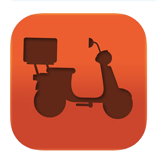
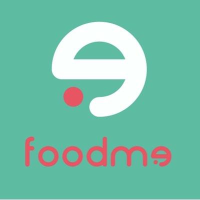
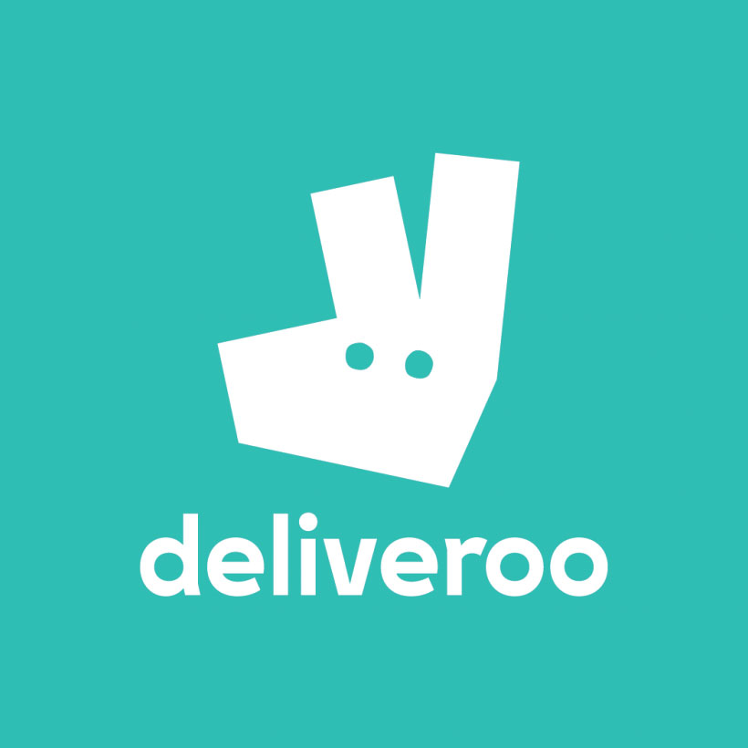
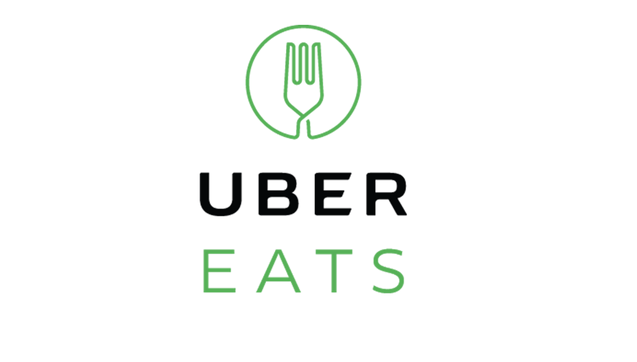

# Introducción

Una emprendedora requiere de una web-app en la que se pueda filtrar restaurantes o negocios de comida de manera fácil sobre todo que esten cerca del rango donde se encuentren.

# Objetivos

El objetivo principal es construit una web-app que sea responsive en una sola pantalla.

Objetivos específicos:

* Entender las necesidades de los usuarios para los que se creará el producto.
* Testear el producto con una cantidad de usuarios específica para lograr un producto eficaz, y que se pueda lanzar al mercado.
* Diseñar y construir una web-app, que sea que sea fácil de manipular, amigable al usuario, además de que se pueda utilizar en distintos dispositivos: moviles, tablets y desktops.

# Consideraciones Generales

La lógica del proyecto esta implementada en JavaScript (ES6), HTML y CSS. Se utilizaran frameworks como Bootstrap.

# General

* Responsive: Este proyecto se verá  bien en dispositivos de pantallas grandes (computadoras/es, laptops, etc.) y pequeñas (tablets, celulares, etc.).

* Enfoque: Busqueda de restaurantes que se encuentren cerca de ti, se podrá por medio de un mapa obtener la ubicación del restaurant que desees visitar. Para un siguiente alcance podrás emitir un pedido de tu restaurante favorito; el cual llegará hasta la puerta de su casa.

# Proto-usuario

Carlos, originario de la Ciudad de México, ahora resideniciado en EEUU. Necesita una web-app de restaurantes que pueda descargar en el movil de su mama y de sus tios , para que ellos obtengan la ubicacion de sus restaurantes favoritos o en su defecto que puedan llevarle la comida hasta su casa, ya que su madre es una señora de edad avanzada y no recuerda muy bien las ubicaciones de los lugares. Anteriormente Carlos era quien la llevaba a todas partes, pero ahora que no esta en su país de origen necesita de una aplicación fácil, rápida y amigable al usuario para su madre.

# Historias de usuarios

* Yo, como usuaria de aplicaciones de comida quiero una web-app que me permita conseguir los mejores restaurantes cerca de mi.
* Yo, como usuaria de aplicaciones de comida quiero una web-app que me muestre la ubicacion del restaurante de mi elección.
* Yo, como usuaria de aplicaciones de comida quiero una web-app de restaurantes que sea fácil de utilizar, y que sea rápida a la hora de buscar restaurantes.

# Alcances esperados con la web-app (Food Map)

Con la creación de la esta web-app de Busqueda de restaurantes, se espera poder encontrar rápidamente el restaurante de su preferencia con su respectiva ubicación y con  la maravillosa posibilidad de que llegue su pedido hasta la puerta de su casa.

Esperamos que Food Map sea un espacio donde los usuarios puedan conseguir su comida favorita, o conocer nuevos lugares de comida , que ellos puedan obtener los resultados que buscan de una forma inmediata , facilitandoles la problemática a la hora de no saber que restaurante elegir o simplemente saber la ubicación de su restaurante favorito que este mas cerca de su ubicación actual, sin importar en que parte de la CDMX se encuentre.

# Preámbulo

Existen millones de restaurantes donde se puede comer rico, que tengan buen sazón, y que se pueda obtener la ubicación de cada uno de ellos es lo más buscado, de hecho en la actualidad existen aplicaciones web-app que te permiten filtrar dichos restaurantes y hacer pedidos de comidas, algunas aplicaciones son:

* Take Eat Easy

Dentro de esta app, el usuario puede encontrar comida a domicilio de los principales restaurantes y puede disfrutarla en casa, la oficina o incluso en un parque como reza en su web. El tiempo estimado de llegada es de 30 minutos y te la trae un ciclista. ¡Hay que fomentar el cuidado de nuestro planeta!

* Foodme

En esta app encontrarás un sinfín de restaurantes saludables, vegetarianos, que no utilicen lactosa o aptos para celiacos. Si eres un restaurante que cumple alguna de las anteriores categorías pide que te incluyan en el directorio de la app.

* Deliveroo

* Sr Perro

Esta simpática app nos servirá si tenemos un “mejor amigo” que queramos que nos acompañe en nuestros momentos foodies. Busca en ella todos los restaurantes que sean dog-friendly y ya sabes… si se porta bien será bienvenido.

* Uber Eats

Uber Eats es la plataforma de entrega de comida que hace que recibir comida deliciosa de tu restaurante favorito sea tan sencillo como pedir un viaje. La app Uber Eats te conecta con una gran variedad de restaurantes locales y comida; así podrás acceder al menú completo de tus restaurantes locales favoritos cuando quieras.

### Se realizó un Benchmark de las principales web-app de comidas:

Como siguiente paso se realizo un sketch a lapiz y papel donde se plasma a grandes rasgos la interfaz con los elementos que ayudaran con la interacción de la misma, el cuál se mostro a nuestro cliente para su aprovación.

Luego de esto, se implemento un menú hamburguesa del lado superior derecho con su respectivo logo, al darle “click” en el menú se desplegará una lista donde se vera la opcion de HOME, al volver a darle “click” al menú de hamburguesa, este se ocultará dandole paso a la primera vista donde se vera el muro en el cual se podra observar una caja que te pregunta de manera muy explicita ¿Qué quieres comer? . Luego se verán distintas publicaciones de los diferentes restaurantes que esten cerca de ti, y hasta la ubicación del mismo. Luego de observar como se vería nuestra interfaz en lapiz y papel , y plasmando todos los requerimientos que se necesitaban se procedió a realizar a color  las interfaces con ayuda de Figma. Se buscó que nuestra interfaz  fuera los mas amigable posible , fácil de usar pero sobre todo fácil de entender para el usuario.

 

 

#  F O O D M A P

Crea una web-app que a través de un input pueda filtrar los restaurantes
que se encuentran cerca de ti *(Tú decides la estructura que tendrán tus datos,
puedes crear una lista de restaurantes en un arreglo, en un objeto, consumir una API, etc. Lo importante es que el contenido debe ser dinámico y no estático y el diseño es totalmente libre)*.

#### Flujo de la aplicación.

Vista splash con duración de 2 segundos que redirecciona a tu vista
principal.

En la vista principal se muestran todos los restaurantes "cerca de ti" junto
con el input para filtrar tu elección *(Los criterios de filtrado son decisión
tuya, puede ser por tipo de comida, costos, orden alfabético, etc.)*.

Ya que se hizo la elección del filtro deben mostrarse únicamente aquellos
restaurantes que cumplan con la condición.

Al seleccionar alguno de los restaurantes, deberá mostrarse la información de
este a través de un modal.

Una vez cerrado el modal debe volver a la vista principal.

